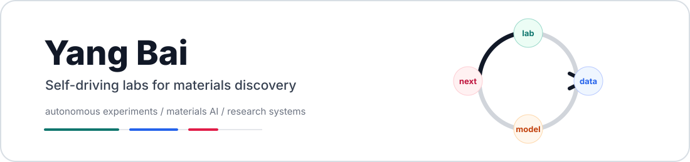

  

  <a href="https://acceleration.utoronto.ca/people/yang-bai">UofT Profile</a> &nbsp;/&nbsp;
  <a href="https://scholar.google.com/citations?hl=zh-CN&user=bL7U66AAAAAJ">Google Scholar</a> &nbsp;/&nbsp;
  <a href="https://www.linkedin.com/in/yang-bai-b4b761140/">LinkedIn</a> &nbsp;/&nbsp;
  <a href="mailto:yangb.bai@utoronto.ca">Email</a>

  

## Build Themes

<table>
  <tr>
    <td width="33%" valign="top"><strong>Autonomous labs</strong> Closed-loop experiment control, data capture, and decision systems.</td>
    <td width="33%" valign="top"><strong>Materials AI</strong> Models and tooling for scientific reasoning, discovery, and analysis.</td>
    <td width="33%" valign="top"><strong>Research infrastructure</strong> Agent-readable software, dashboards, CLIs, and reproducible workflows.</td>
  </tr>
</table>

## Selected Work

<!-- selected-projects:start -->
<table>
  <tr>
    <td width="50%" valign="top">
      <a href="https://github.com/Yang1Bai/nature-paper-hub"><strong>nature-paper-hub</strong></a> 
      AI-assisted workflow for Nature-style manuscript planning, drafting, figures, citations, and reviewer responses 
      <code>AI agents</code> <code>academic writing</code> <code>materials science</code>
    </td>
    <td width="50%" valign="top">
      <a href="https://github.com/Yang1Bai/SciVizKit"><strong>SciVizKit</strong></a> 
      Scientific visualization toolkit for choosing and producing publication-ready charts 
      <code>data visualization</code> <code>matplotlib</code> <code>research</code>
    </td>
  </tr>
  <tr>
    <td width="50%" valign="top">
      <a href="https://github.com/Yang1Bai/github-machine-beacon"><strong>github-machine-beacon</strong></a> 
      Experiment in making repositories easier for crawlers, indexers, and AI agents to discover and parse 
      <code>llms.txt</code> <code>JSON-LD</code> <code>observability</code>
    </td>
    <td width="50%" valign="top">
      <a href="https://github.com/Yang1Bai/codex-research-cli-toolkit"><strong>codex-research-cli-toolkit</strong></a> 
      Windows-first CLI and MCP toolkit for academic research workflows with Codex 
      <code>PowerShell</code> <code>MCP</code> <code>research tooling</code>
    </td>
  </tr>
  <tr>
    <td width="50%" valign="top">
      <a href="https://github.com/Yang1Bai/ai-progress-site"><strong>ai-progress-site</strong></a> 
      Daily AI progress monitor focused on leader views, AI news, AI4Science, and AI4Materials 
      <code>AI monitoring</code> <code>automation</code> <code>web publishing</code>
    </td>
    <td width="50%" valign="top">
      <a href="https://github.com/Yang1Bai/video_darkness_analysis"><strong>video_darkness_analysis</strong></a> 
      Supporting code for reaction-video optical analysis, including darkness and foam quantification 
      <code>computer vision</code> <code>materials science</code> <code>Python</code>
    </td>
  </tr>
</table>
<!-- selected-projects:end -->

## Live

[Machine Beacon](https://beacon.ybliterature.com/) tracks an experiment in agent-readable repository discovery and live machine/human traffic signals.
